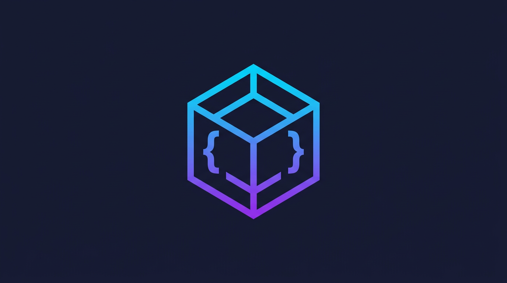
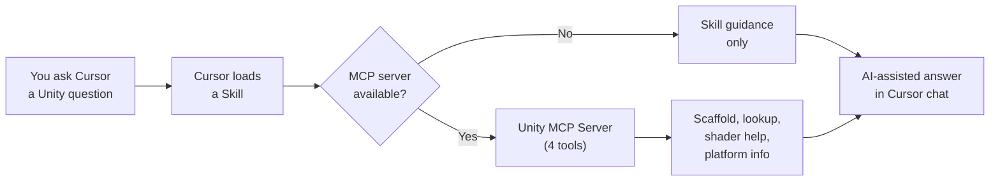

<p align="center">
  
</p>

<h1 align="center">Unity Developer Tools</h1>

<p align="center">
  <strong>AI-powered development toolkit for Unity game development in Cursor IDE.</strong>
</p>

<p align="center">
  
  
  
  <a href="https://tmhsdigital.github.io/Unity-Developer-Tools/"></a>
</p>

<p align="center">
  <a href="docs/GETTING-STARTED.md"><strong>Getting Started</strong></a> &bull;
  <a href="https://tmhsdigital.github.io/Unity-Developer-Tools/">Documentation</a> &bull;
  <a href="#features">Features</a> &bull;
  <a href="#quick-start">Quick Start</a> &bull;
  <a href="#mcp-server">MCP Server</a> &bull;
  <a href="#skills-18">Skills</a> &bull;
  <a href="#rules-8">Rules</a> &bull;
  <a href="#roadmap">Roadmap</a>
</p>

---

<p align="center">
  18 skills &nbsp;&bull;&nbsp; 8 rules &nbsp;&bull;&nbsp; 4 MCP tools &nbsp;&bull;&nbsp; 20 snippets &nbsp;&bull;&nbsp; 5 templates
</p>

Scaffold Unity scripts, look up APIs, generate shader patterns, detect render pipelines, and write optimized C# -- all from within Cursor's AI chat. Covers the full Unity development lifecycle from project setup to platform deployment.

<p align="center">
  <a href="docs/GETTING-STARTED.md"></a>
</p>

> **First time here?** The **[Getting Started guide](docs/GETTING-STARTED.md)** walks you through every step -- from installing prerequisites to building your first Unity project with AI assistance. No prior Cursor plugin experience required.

## How It Works



**Skills** teach Cursor how to handle Unity development prompts. **Rules** enforce Unity best practices in your code. The **MCP server** provides programmatic tools so skills can scaffold scripts, look up APIs, and generate shader patterns directly.

## Quick Start

Already have Git, Python 3.10+, and Cursor installed? Here's the short version:

```bash
git clone https://github.com/TMHSDigital/Unity-Developer-Tools.git
# Open Unity-Developer-Tools folder in Cursor (File > Open Folder)
cd mcp-server && pip install -r requirements.txt
```

Then ask the AI agent to scaffold a MonoBehaviour, look up an API, or generate a shader effect.

> **Need more detail?** The **[Getting Started guide](docs/GETTING-STARTED.md)** covers installing prerequisites, troubleshooting, and building your first project step by step.

## Features

- **Script scaffolding** -- Generate MonoBehaviours, ScriptableObjects, Editor windows, and ECS systems following Unity 6 conventions
- **API lookup** -- Search common Unity APIs by name, namespace, or category via MCP tools
- **Shader patterns** -- Get HLSL code and Shader Graph node setups for common effects (dissolve, outline, hologram, etc.)
- **Performance-aware coding rules** -- Catch deprecated APIs, allocation-heavy patterns, and common mistakes
- **Snippet library** -- 20 copy-paste-ready code patterns for C#, shaders, and Visual Scripting
- **Render pipeline detection** -- Automatically adapt guidance to URP, HDRP, or Built-in
- **Platform targeting** -- Platform-specific defines, capabilities, and build recommendations
- **Template projects** -- 5 starter templates for 2D, 3D, UI, architecture patterns, and editor tools

<details>
<summary><strong>Supported Workflows</strong></summary>

&nbsp;

| Workflow | Description |
|:---------|:------------|
| MonoBehaviour | Classic Unity scripting with lifecycle methods |
| ScriptableObject Architecture | Data-driven design with events, variables, runtime sets |
| ECS/DOTS | High-performance data-oriented tech stack |
| Visual Scripting | Node-based scripting for designers |
| Editor Tooling | Custom inspectors, windows, overlays, gizmos |

</details>

<details>
<summary><strong>Supported Render Pipelines</strong></summary>

&nbsp;

| Pipeline | Status |
|:---------|:-------|
| **URP** (Universal) | Primary -- recommended for all new projects |
| **HDRP** (High Definition) | Supported -- maintenance mode guidance |
| **Built-in** (Legacy) | Migration guidance -- deprecated in Unity 6.5 |

</details>

<details>
<summary><strong>Supported Platforms</strong></summary>

&nbsp;

| Platform | Backend |
|:---------|:--------|
| Windows | IL2CPP or Mono |
| macOS | IL2CPP or Mono |
| Linux | IL2CPP or Mono |
| iOS | IL2CPP |
| Android | IL2CPP |
| WebGL | IL2CPP (WebGPU opt-in) |
| Consoles | IL2CPP |

</details>

## Skills (18)

| Skill | What it does |
|:------|:-------------|
| **Project Setup** | Unity project configuration, folder structure, assembly definitions, package management |
| **MonoBehaviour Patterns** | Lifecycle methods, Awaitable async, FindFirstObjectByType, design patterns |
| **ScriptableObjects** | Data-driven architecture with events, variables, and runtime sets |
| **Physics (2D/3D)** | Rigidbody, collisions, raycasting, layers, NonAlloc patterns |
| **UI Development** | UI Toolkit (primary), Runtime Data Binding, Canvas/UGUI for legacy |
| **Shader Development** | Shader Graph, HLSLPROGRAM, ShaderLab for URP, Render Graph integration |
| **Animation Systems** | Animator controllers, DOTween, Timeline, sprite animation |
| **Audio Systems** | AudioSource, AudioMixer, spatial audio, music management |
| **Input Systems** | New Input System with Action Assets, composite bindings, legacy migration |
| **Networking** | Netcode for GameObjects, Netcode for Entities, Photon Fusion 2, Mirror |
| **Editor Scripting** | Custom inspectors, editor windows, Scene View overlays, gizmos |
| **Performance Optimization** | Profiler, Burst, Jobs, object pooling, memory management |
| **Render Pipeline Detection** | Auto-detect URP, HDRP, or Built-in and adapt code accordingly |
| **ECS/DOTS** | Entity Component System, ISystem, IJobEntity, SystemAPI.Query, Burst |
| **Visual Scripting** | Script Graphs, State Graphs, Subgraphs, custom nodes |
| **Testing** | Edit Mode and Play Mode tests with Unity Test Framework 2.x |
| **Addressables** | Async asset loading, groups, labels, remote content delivery |
| **Platform Targeting** | Platform defines, IL2CPP/CoreCLR backends, build settings |

## Rules (8)

| Rule | What it enforces |
|:-----|:-----------------|
| **C# Unity Conventions** | SerializeField, Awaitable over coroutines, modern API usage |
| **MonoBehaviour Lifecycle** | Correct initialization order, Update vs FixedUpdate usage |
| **Performance Rules** | No FindObjectOfType, no Resources.Load, allocation warnings |
| **Naming Conventions** | PascalCase methods, _camelCase privates, Unity-standard naming |
| **Serialization Rules** | Proper `[SerializeField]`, `[field: SerializeField]` for events |
| **Shader Conventions** | HLSLPROGRAM over CGPROGRAM, URP-first shader patterns |
| **Visual Scripting Conventions** | Graph naming, Subgraph usage, variable scoping |
| **Security and Builds** | No credentials in code, IL2CPP stripping, signed packages |

## Snippets (20)

<details>
<summary><strong>C# (15)</strong></summary>

&nbsp;

| Snippet | Description |
|:--------|:------------|
| `monobehaviour-template.cs` | Complete MonoBehaviour with lifecycle methods |
| `singleton-pattern.cs` | Thread-safe singleton using FindFirstObjectByType |
| `object-pool.cs` | Generic object pool with warm-up and auto-expand |
| `scriptableobject-template.cs` | ScriptableObject with custom editor support |
| `coroutine-pattern.cs` | Coroutine patterns with cancellation |
| `async-await-pattern.cs` | Awaitable async with single-await pooling rule |
| `event-system.cs` | C# event system with UnityEvent integration |
| `state-machine.cs` | Finite state machine pattern |
| `custom-inspector.cs` | Custom inspector with UI Toolkit |
| `editor-window.cs` | Editor window with UI Toolkit |
| `property-drawer.cs` | Custom property drawer |
| `input-system-actions.cs` | New Input System with Action Assets |
| `raycast-patterns.cs` | Physics.Raycast and NonAlloc patterns |
| `interface-component.cs` | Interface-based component communication |
| `save-load-json.cs` | JSON save/load with Application.persistentDataPath |

</details>

<details>
<summary><strong>Shaders (4)</strong></summary>

&nbsp;

| Snippet | Description |
|:--------|:------------|
| `unlit-basic.shader` | Basic unlit shader for URP (HLSLPROGRAM) |
| `urp-lit-template.shader` | PBR lit shader template for URP |
| `hlsl-vertex-fragment.shader` | Custom vertex/fragment with URP lighting |
| `surface-basic.shader` | Legacy surface shader (Built-in only) |

</details>

<details>
<summary><strong>Visual Scripting (1)</strong></summary>

&nbsp;

| File | Description |
|:-----|:------------|
| `README.md` | Graph architecture patterns and Subgraph conventions |

</details>

## Templates (5)

| Template | Description |
|:---------|:------------|
| **2D Platformer** | Player controller with new Input System, camera follow, game manager |
| **3D FPS** | First-person controller, weapon system, game manager |
| **UI Menu System** | UI Toolkit menus with settings persistence |
| **ScriptableObject Architecture** | Event system, float variables, runtime sets -- Ryan Hipple pattern |
| **Editor Tool** | Level builder window with UI Toolkit and Scene View integration |

## MCP Server

The companion MCP server provides programmatic tools that Cursor's AI agent can call directly. Configuration lives in `.cursor/mcp.json`.

**Prerequisites:** Python 3.10+

```bash
cd mcp-server
pip install -r requirements.txt
```

The server starts automatically when Cursor invokes an MCP tool.

<details>
<summary><strong>Available Tools (4)</strong></summary>

&nbsp;

| Tool | Description |
|:-----|:------------|
| `scaffold_script` | Generate C# scripts following Unity 6 conventions. Supports MonoBehaviour, ScriptableObject, Editor, and ECS templates. |
| `lookup_api` | Search the Unity API reference database by name, namespace, or category. Returns signatures, descriptions, and examples. |
| `shader_helper` | Get shader code patterns for common effects (dissolve, outline, hologram, etc.) with HLSL and Shader Graph guidance. |
| `platform_info` | Get platform-specific defines, capabilities, limitations, and build recommendations. |

</details>

<details>
<summary><strong>Usage Examples</strong></summary>

&nbsp;

**Scaffold a script:**
```
Create a MonoBehaviour for a health system with damage, healing, and death events
```

**Look up an API:**
```
How do I use Addressables.LoadAssetAsync?
```

**Get a shader pattern:**
```
Show me a dissolve effect shader for URP with edge glow
```

**Get platform info:**
```
What are the WebGL limitations and recommended settings?
```

</details>

## Project Structure

```
Unity-Developer-Tools/
  .cursor-plugin/      Plugin manifest
  .cursor/             MCP server configuration
  skills/              AI skill files (18 skills)
  rules/               Coding convention rules (8 rules)
  snippets/            Code snippets -- C#, shaders (20 files)
  templates/           Starter project templates (5 sets)
  mcp-server/          Python MCP server (4 tools) and data files
  docs/                Architecture, roadmap, contributing guide
  assets/              Logo and images
  .github/             CI/CD workflows (5 workflows)
```

## Roadmap

See [docs/ROADMAP.md](docs/ROADMAP.md) for the full project roadmap.

<details>
<summary><strong>Release Plan</strong></summary>

&nbsp;

| Version | Milestone | Status |
|:--------|:----------|:-------|
| **v0.1.0** | Foundation -- skills, rules, snippets, templates, MCP server, CI/CD | Done |
| **v1.0.0** | M1 Complete -- 18 skills, 8 rules, 20 snippets, 5 templates, 4 MCP tools | Done |
| **v1.1.0** | CI/CD overhaul -- 8-job validation, zip releases, auto-labeling, data refresh | Done |
| **v2.0.0** | M2 Intelligence -- expanded API DB, version detection, shader conversion | Planned |
| **v3.0.0** | M3 Advanced -- ECS codegen, build automation, VFX/Cinemachine, AI/ML | Planned |
| **v4.0.0** | M4 Polish -- marketplace listing, community templates, localization | Planned |

</details>

## Contributing

See [docs/CONTRIBUTING.md](docs/CONTRIBUTING.md) for guidelines on adding skills, rules, and improvements.

## Support

If this plugin is useful to you, consider [sponsoring the project](https://github.com/sponsors/TMHSDigital).

## License

CC BY-NC-ND 4.0 -- see [LICENSE](LICENSE) for details.

<details>
<summary><strong>Unity Reference Links</strong></summary>

&nbsp;

- [Unity Manual](https://docs.unity3d.com/Manual/)
- [Unity Scripting API](https://docs.unity3d.com/ScriptReference/)
- [Unity Package Manager](https://docs.unity3d.com/Manual/Packages.html)
- [Unity Forums](https://discussions.unity.com/)
- [Unity Issue Tracker](https://issuetracker.unity3d.com/)

</details>

---

<p align="center">
  <strong>Built by <a href="https://github.com/TMHSDigital">TMHSDigital</a></strong>
</p>
