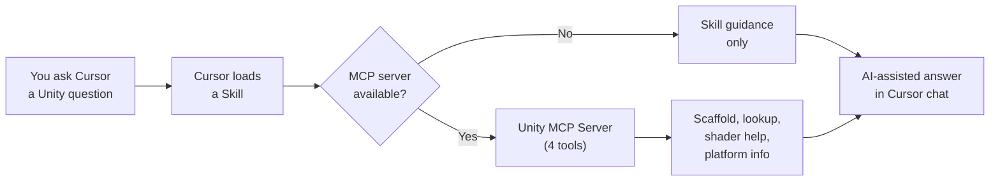

# Unity Developer Tools

**AI-powered development toolkit for Unity game development in Cursor IDE.**

18 skills -- 8 rules -- 4 MCP tools -- 20 snippets -- 5 templates

---

## What is this?

Unity Developer Tools is a plugin for [Cursor](https://www.cursor.com/) that teaches its AI assistant how to build Unity games and tools. Once installed, you can ask the AI to:

- Scaffold MonoBehaviours, ScriptableObjects, Editor windows, and ECS systems
- Look up Unity APIs by name, namespace, or category
- Generate shader patterns for common effects (dissolve, outline, hologram, etc.)
- Get platform-specific defines, capabilities, and build recommendations
- Write code that follows Unity 6 best practices automatically

## Quick start

```bash
git clone https://github.com/TMHSDigital/Unity-Developer-Tools.git
cd mcp-server && pip install -r requirements.txt
```

Open the `Unity-Developer-Tools` folder in Cursor, then ask the AI to scaffold a script, look up an API, or generate a shader effect.

For a detailed walkthrough, see the [Getting Started guide](GETTING-STARTED.md).

## Features

- **Script scaffolding** -- Generate MonoBehaviours, ScriptableObjects, Editor windows, and ECS systems following Unity 6 conventions
- **API lookup** -- Search common Unity APIs by name, namespace, or category via MCP tools
- **Shader patterns** -- Get HLSL code and Shader Graph node setups for common effects
- **Performance-aware coding rules** -- Catch deprecated APIs, allocation-heavy patterns, and common mistakes
- **Snippet library** -- 20 copy-paste-ready code patterns for C#, shaders, and Visual Scripting
- **Render pipeline detection** -- Automatically adapt guidance to URP, HDRP, or Built-in
- **Platform targeting** -- Platform-specific defines, capabilities, and build recommendations
- **Template projects** -- 5 starter templates for 2D, 3D, UI, architecture patterns, and editor tools

## Supported workflows

| Workflow | Description |
|:---------|:------------|
| MonoBehaviour | Classic Unity scripting with lifecycle methods |
| ScriptableObject Architecture | Data-driven design with events, variables, runtime sets |
| ECS/DOTS | High-performance data-oriented tech stack |
| Visual Scripting | Node-based scripting for designers |
| Editor Tooling | Custom inspectors, windows, overlays, gizmos |

## Supported render pipelines

| Pipeline | Status |
|:---------|:-------|
| **URP** (Universal) | Primary -- recommended for all new projects |
| **HDRP** (High Definition) | Supported -- maintenance mode guidance |
| **Built-in** (Legacy) | Migration guidance -- deprecated in Unity 6.5 |

## How it works



**Skills** teach Cursor how to handle Unity development prompts. **Rules** enforce Unity best practices in your code. The **MCP server** provides programmatic tools so skills can scaffold scripts, look up APIs, and generate shader patterns directly.

## Links

- [Getting Started](GETTING-STARTED.md) -- full installation and first-project walkthrough
- [Architecture](ARCHITECTURE.md) -- how the plugin and MCP server work together
- [Roadmap](ROADMAP.md) -- planned features and milestones
- [Contributing](CONTRIBUTING.md) -- how to add skills, templates, and improvements
- [GitHub Repository](https://github.com/TMHSDigital/Unity-Developer-Tools)
